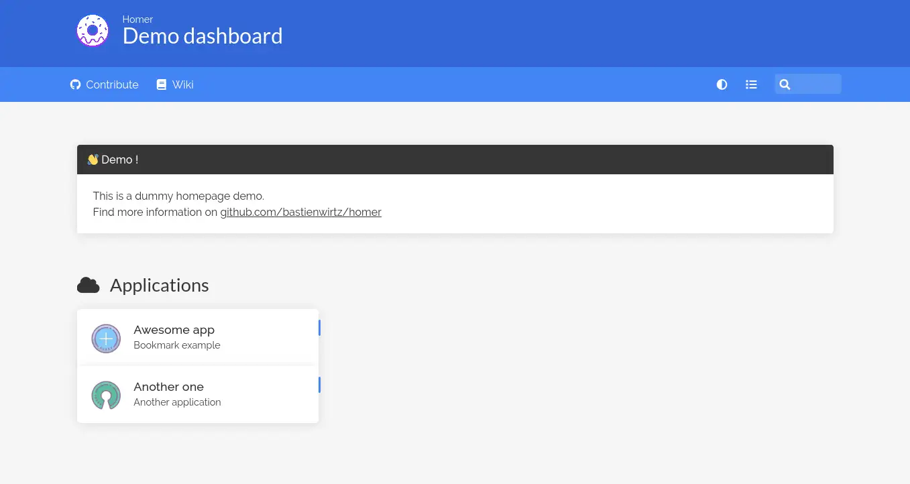

# Homer pour YunoHost

[](https://dash.yunohost.org/appci/app/homer)    
[](https://install-app.yunohost.org/?app=homer)

*[Read this readme in english.](./README.md)*
*[Lire ce readme en français.](./README_fr.md)*

> *Ce package vous permet d'installer Homer rapidement et simplement sur un serveur YunoHost.
Si vous n'avez pas YunoHost, regardez [ici](https://yunohost.org/#/install) pour savoir comment l'installer et en profiter.*

## Vue d'ensemble

Une page d'accueil simpliste pour votre serveur.

### Fonctionnalités

- fichier de configuration en yaml
- Recherche
- Groupes
- Personnalisation des thèmes
- Vérification hors-ligne des services
- Raccourcis clavier :
    - `/` Rechercher
    - `Escape` Quitter la recherche
    - `Enter` Ouvrir le premier résultat de recherche
    - `Alt`/`Option` + `Enter` Ouvrir le premier résultat de recherche dans un nouvel onglet


**Version incluse :** 21.09.2~ynh1

**Démo :** https://homer-demo.netlify.app/

## Captures d'écran



## Avertissements / informations importantes

* Tous les utilisateurs on la même page d'accueil, il n'y a pas de configuration par-utilisateur

## Documentations et ressources

* Site officiel de l'app : https://github.com/bastienwirtz/homer
* Documentation officielle utilisateur : https://github.com/bastienwirtz/homer/blob/main/docs/configuration.md
* Documentation officielle de l'admin : https://github.com/bastienwirtz/homer/blob/main/docs/configuration.md
* Dépôt de code officiel de l'app : https://github.com/bastienwirtz/homer
* Documentation YunoHost pour cette app : https://yunohost.org/app_homer
* Signaler un bug : https://github.com/YunoHost-Apps/homer_ynh/issues

## Informations pour les développeurs

Merci de faire vos pull request sur la [branche testing](https://github.com/YunoHost-Apps/homer_ynh/tree/testing).

Pour essayer la branche testing, procédez comme suit.
```
sudo yunohost app install https://github.com/YunoHost-Apps/homer_ynh/tree/testing --debug
ou
sudo yunohost app upgrade homer -u https://github.com/YunoHost-Apps/homer_ynh/tree/testing --debug
```

**Plus d'infos sur le packaging d'applications :** https://yunohost.org/packaging_apps